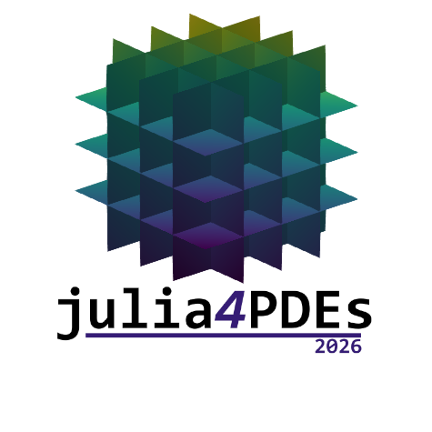

:{ .align-center }

In this workshop, we will gather the scientific community using the Julia programming
language for the numerical solution of Partial Differential equations (PDEs). This is a diverse
community that includes researchers from different domains such as applied mathematics,
HPC, as well as applications like aerospace, civil engineering, and computational physics.
A central theme will be to align efforts within the
community, learn from each other, and identify opportunities for collaboration.
